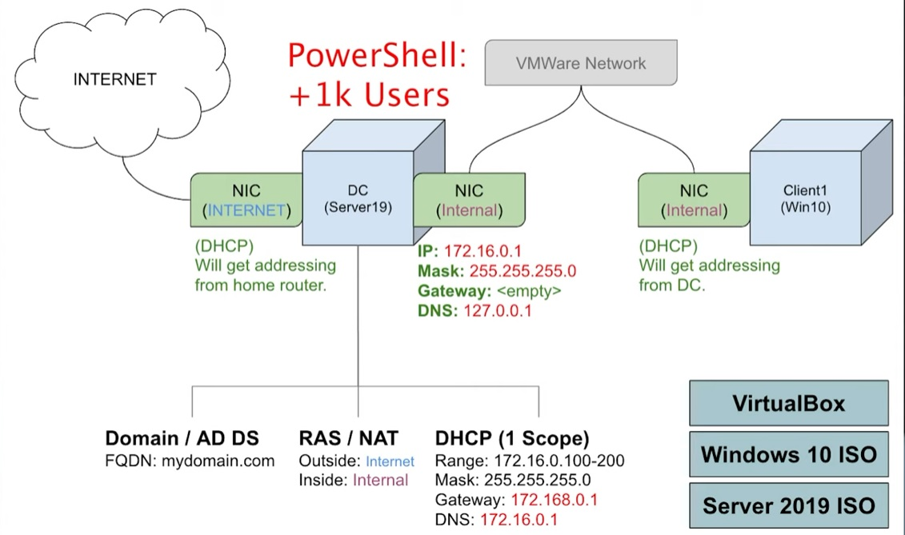

# Active Directory Virtual Home Lab
This GitHub repo is to demonstrate and show my journey on learning Microsoft's **Active Directory** system used in **IT Help Desk** and **Support Roles**. I’m using **Windows Server 2022** and **Windows 11** virtual machines inside **VirtualBox** to simulate a small business network and practice real-world IT administration skills.

## Network Diagram

Here is a visualization of what is happening in this Active Directory home lab and the connections between the Domain Controller to the Windows Client Machine

## Lab Overview:

This homelab project will cover:
  - Installing and configuring **Windows Server 2022**
  - Setting up **Active Directory Domain Services (AD DS)**
  - Creating and managing **users, groups, and organizational units**

  - Configuring **DNS**, **DHCP**, and **Remote Acess**
  - Applying **Group Policy Objects (GPOs)**
  - Joining a **Windows 11 client** to the domain
  - Using **PowerShell** for automation and administrative tasks

## Progress Logs

| Date | Topic | Description |
|------|--------|-------------|
| 2025-10-20 | Windows Server Installation | Installed Windows Server 2022 on VirtualBox and set up the initial Administrator account. |
| 2025-10-22  | Domain Configuration | Configured Windows Server 22 VM to use Active Directory server's IP Address as its DNS server to connect client and DC VMs together |
| 2025-10-24 | Active Directory Installiation | Installed Active Directory Domain Services to Server 2022 for promoting server to Domain Controller. Named domain to jotewodomain.com |
| 2025-10-25 | New User Creation | Opened Active Directory Users and Computers application, practiced creating new user account by adding all information like name, creating password, etc |
| 2025-10-27 | Creating Local Admin Account | Created an Organizational Unit (OU) for Admins and added a new Admin account with appropriate permissions. Tested login under the new admin credentials successfully. |
| 2025-10-29 | Remote Access Configuration | Installed Remote Access on Server in order for client machines within the internal network to have access to the internet with NAT |
| 2025-10-31 | DHCP Server Configuration | Installed and configured the DHCP role on the Domain Controller to automatically assign IP addresses within the internal network via a defined DHCP Scope and subnet. |
| 2025-11-02 | PowerShell AD Automation | Ran a PowerShell script from Josh Madakor’s AD Homelab tutorial that automatically created hundreds of random user accounts within a specific Organizational Unit in Active Directory to simulate a real-world enterprise environment. |
| 2025-11-06 | Windows 10 Client Installation | Installed Windows 10 Pro VM for Client after dealing with issues with Windows 11 OS. Created local user account. Added router to DHCP Server on Domain Controller to connect with client VM |
| 2025-11-07 | Account Management Testing | Tested enabling and disabling user accounts on the Windows 10 client VM through Active Directory Users and Computers to simulate real-world account management scenarios. Verified that disabled accounts were unable to log in and re-enabled accounts regained access successfully. |
| 2025-11-09 | Group Policy Configuration | Created and tested common Group Policy Objects (GPOs) such as password complexity, account lockout policies, and disabling Command Prompt for standard users to strengthen security and practice centralized policy management. |
| 2025-11-11 | Group Policy Testing | Tested enforced GPOs such as account lockout and restrictions on Control Panel and Command Prompt access for client users. Additionally, practiced unlocking a locked-out user account through Active Directory Users and Computers to simulate real-world account recovery procedures. |
| 2025-11-15 | File Sharing & Permissions | Created a shared folder in Server Manager and configured file-share permissions. Set up department-based security groups (e.g., HR, Front Desk) and assigned users to each group to test access control. Verified that only authorized groups could access specific folders and practiced mapping the shared folder as a network drive on the client machine. |
| 2025-11-19 | Advanced File Sharing & OU Organization | Continued practicing file sharing by creating additional department-based security groups such as Sales and Marketing and assigning users accordingly. Also created separate Organizational Units (OUs) for each department to improve user organization and streamline permission management. |

## Tools Used
- [Oracle VirtualBox](https://www.virtualbox.org/wiki/Downloads)
- [Windows Server 2022 Standard (Desktop Experience)](https://go.microsoft.com/fwlink/p/?linkid=2195686&clcid=0x409&culture=en-us&country=us)
- [Windows 11 Enterprise](https://go.microsoft.com/fwlink/p/?linkid=2195682&clcid=0x409&culture=en-us&country=us)
- PowerShell
- Active Directory Domain Services (AD DS)
- Remote Access
- DNS & DHCP
