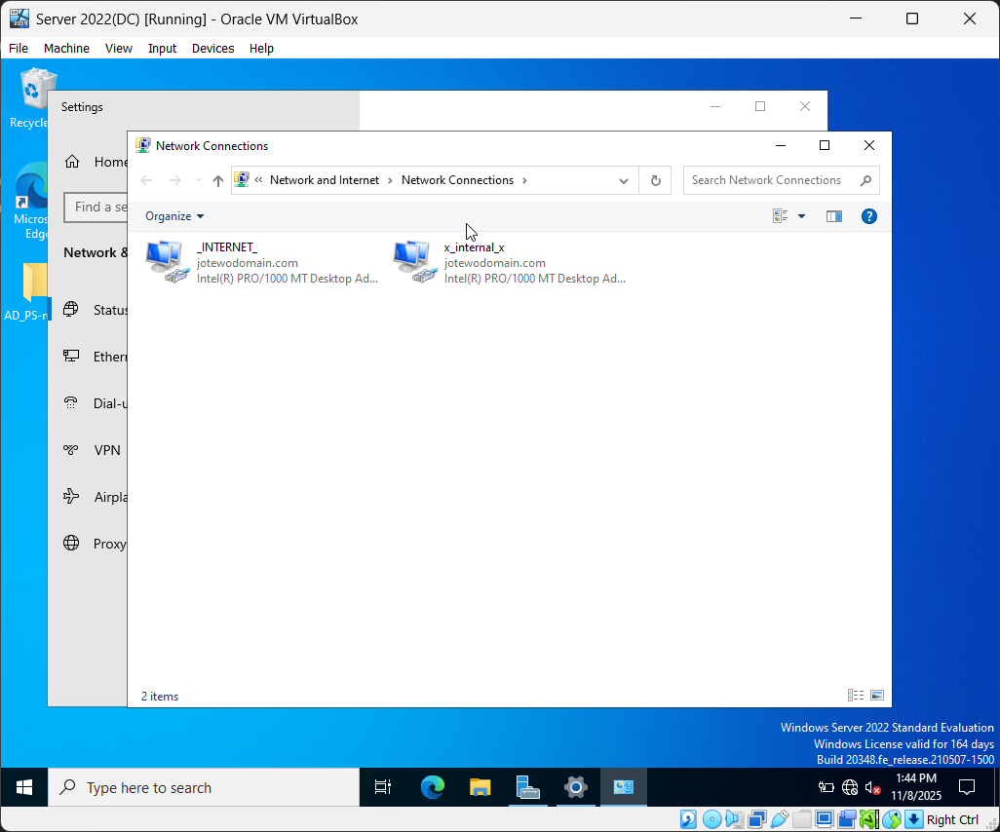

# Network Configuration for Domain Controller (DC)

## Objective:
In this section, I configured the network settings for the Windows Server 2022 Domain Controller to allow proper communication between the internal network (for client machines) and the external network (for internet access).

## Goal:
The goal of this section of the the homelab is to:
- The Domain Controller is assigned a **Static** IP Address.
- Client VMs can communicate with the DC through the **Internal Network**.
- The DC can still reach the **Internet** through its NAT Adaptor from our host machine.

---

## Overview of Network Setup
The Domain Controller will have **two network adapters** configured in VirtualBox:

| Adapter | Type | Purpose |
|----------|------|----------|
| Adapter 1 | NAT | Provides internet access to the DC |
| Adapter 2 | Internal Network | Allows communication with client machines inside the internal lab network |

---

### Step 0: Verify VirtualBox Network Adapters
- Before continuing any further with this part of the homelab, verify that [Step 3](./01_windows-server-installiation.md) from the Windows Server 2022 Installation reading has been correctly configured by seeing that the network adapters for the DC Virtual Machine are correct with a Nat and Internal Network Adapters.

### Step 1: Assign Static IP Address to Internal Network

1. Boot up the Server 2022 VM and log in with your local admin account
2. Once logged in, go down to the search bar on the task bar and enter **Network Status**. An option should appear and click on it.
3. Then, navigate down to **Advanced Network Settings** and click on **Change Adapter Options** and a window should appear.

4. In the window, there should be two network adapters, named, **Ethernet 1** and **Ethernet 2**.
5. Next, we need to identify which adapter is the NAT and the Internal Network and then rename them to reflect that.
6. Right-Click on either adapter > Status > Details. Look at the **IPv4 Address** and see what the address begins with. If the address starts with '169', it indicates that this connection doesn't have any internet access, which means that this is the **Internal Network**. If not, then it is the NAT Adapter.
7. Rename both of the adapters to differentiate which of them are the Internet and which is the Internal Network

8. Now, right-click on the **Internal Network** Adapter > Select **Properties** > Click on **Internet Protocol Version 4 (TCP/IPv4)** → **Properties**.
9. Set the following values:

| Setting | Value |
|----------|--------|
| IP Address | `172.16.0.1` |
| Subnet Mask | `255.255.255.0` |
| Default Gateway | *(Leave Blank)* |
| Preferred DNS Server | `127.0.0.1` *(points to itself for DNS resolution after AD is installed)* |  

10. Click **'OK'** to apply those changes

## Step 3: Test Network Connectivity

To ensure that the static IP assignment is configured and working properly

1. Open **Command Prompt**
2. Type **'ipconfig'** into the terminal. You should see the **Static IP Address**(172.16.0.1) and the **Subnet Mask**(255.255.255.0).
3. Run **ping www.google.com** to test if the server has internet access and establish a connection through the NAT Adapter

---

## Why These IP Addresses are Important:
Assigning a **static IP Address** for the internal adapter is a crucial step because the Domain Controller must always be reachable at the same address by client machines.

If the server's IP address were to dynamically change with **DHCP**, any users on client machines would lose their ability to authenticate within the **Domain Controller**.

Here’s what each value achieves:

| Setting | Purpose |
|----------|----------|
| **172.16.0.1** | The DC’s permanent address on the internal network — this acts as the “gateway” for internal traffic. |
| **255.255.255.0** | Defines the subnet, ensuring all client devices in `172.16.0.x` can communicate locally with the DC. |
| **Default Gateway (blank)** | Not needed for internal communication — internet traffic is handled by the NAT adapter. |
| **DNS Server: 127.0.0.1** | Points DNS queries to the local server, which will later host the Active Directory-integrated DNS service. |

This setup mirrors a real-world enterprise environment where a DC provides name resolution and authentication within a private network.

---

## Summary
At this stage:
- The Domain Controller's network is configured.
- It has a static IP Address for internal network communication.
- The DC retains internet access through the NAT Adapter.
- The setup is now ready for installing Active Directory Domain Services(AD DS) and promoting the server to a Domain Controller.

➡️ Continue to: [Active Directory Setup](./03_active-directory-setup.md)
