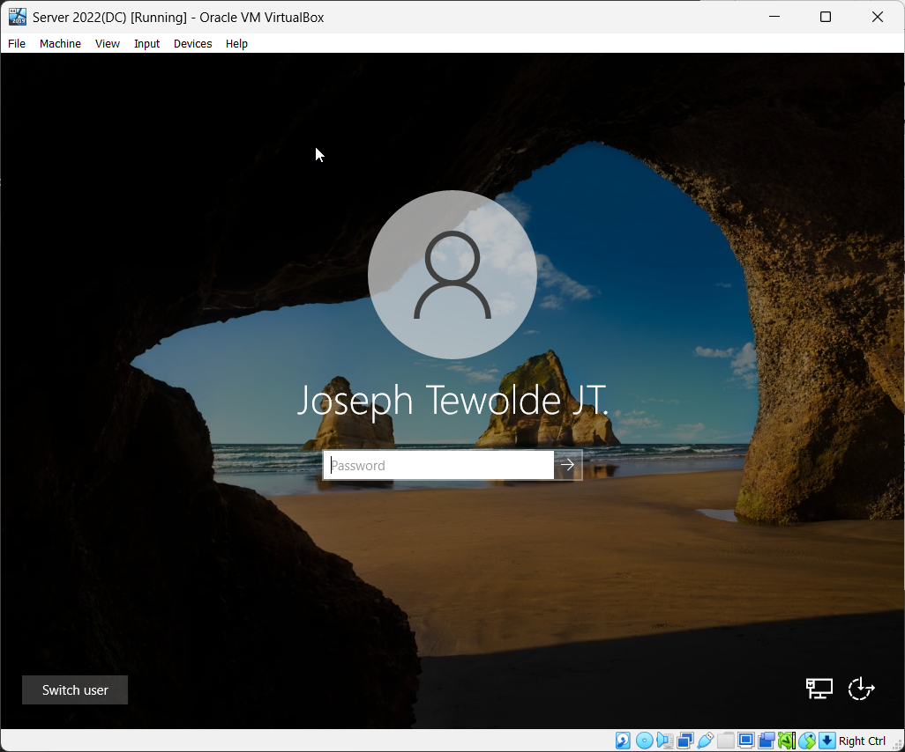

# Active Directory Setup

## Objective:
In this section, I will set up **Active Directory Domain Services (AD DS)** on the Windows Server 2022 Domain Controller (DC) virtual machine. This will allow the server to function as the central authentication and management point for all users and computers within the internal network.

## Overview:
**Active Directory(AD)** is a critical Windows Server role that enables centralized management of network resources such as users, computers, and groups. Once configured, the Domain Controller will:

- Host the Active Directory Domain Services (AD DS) role

- Manage user authentication and permissions

- Allow client machines (like Windows 11) to join the domain

- Serve as the foundation for Group Policy Objects (GPOs) and other administrative configurations

---

### Step 1: Install Active Directory Domain Services(AD DS)

1. Open Server Manager from the start menu
2. Click on **Add Roles and Features** either through the quick menu or through the Manage Option.
3. A Wizard should pop up, click **Next** until you reach the **Server Roles** Section.
4. Check the box for **Active Directory Domain Services**.
5. When prompted, click **Add Features**.
8. Continue clicking **Next** until you reach the **Confirmation** Page, then click **Install**.
7. Wait for the installation to finish and then close the window.

## Step 2: Promote the Server to a Domain Controller

1. After the installation is complete, click on the flag icon on the upper-right hand corner of the Server Manager. There should be a yellow warning icon there. Click on it and select **Promote this Server to a Domain Controller**.
2. Select **Add New Forest** and you'll be asked to name the domain. Name it whatever you want, I named mine: jotewodomain.com.
3. Set a Directory Services Restore Mode (DSRM) password and continue.
4. Accept the default DNS and NetBIOS names when prompted.
5. Review all settings and click Install.
6. You will be instructed that the server will need to restart. When it boots back up and try to login in, it will show your domain/admin name.

## Step 3: Create Organizational Units(OU) for Admins and Users

Now that the **Domain Controller** is fully configured, the next step is to organize Active Directory by creating a dedicated Admins OU and create a new Admin User inside of it. 

1. Open **Server Manager** > Click **Tools**(top-right) > Select **Active Directory Users and Computers**
2. On the left side panel, right-click on your domain > Hover over **New** > Select **Organizational Unit**. Name the organizational unit, **_ADMINS**. This OU will store and manage all adminstrative accounts.
3. Create another organization unit for users, name the OU, **_USERS**.

## Step 4: Create Admin and User Account
1. Start by right-clicking the newly created **Admins** OU.
2. Go down to **New** > Select **User** for creating a new admin user.
3. Enter necessary details such as:
    - **First Name**: "Test"
    - **Last Name**: "Admin"
    - **User Logon Name**: "tadmin"
4. Click **'Next'** to proceed with setting a password for the account.
5. Uncheck the **'User must change password at next logon'** option and check **'Password Never Expires'** for testing purposes.
6. Set a password that you can easily remember for testing purposes with this homelab. In reality, you would set a strong password.
7. Click **'Finish'** to finalize creating the admin account.

Now, you should see your newly created admin account inside of the **Admins** Organizational Unit!

For creating the User account, you will follow the same steps above but just create the user inside your **'Users'** Organizational Unit instead!

## Step 5: Assign Domain Admin Permissions

The final step of this setting up your created Admin account is assigning **Domain Admin Permissions**.

1. Start by right-clicking on your admin account in the **'Admins'** OU > Select **'Properties'**.
2. Select the **'Member Of''** Tab near the top of the window > Click **'Add'**.
3. Inside the **'Enter Object Names'** field, type in **"Domain Admins"** > Click **"Check Names"** on the right on the field > Click **Ok**.

Now, your new account will have full domain administrative privileges!

To test it out, sign out and log back in with the new account, you should have access to Active Directory like before!

---

## Summary:
At this point, the Domain Controller is fully configured with:
- Active Directory Domain Services installed
- A functioning domain
- A structured Organizational Unit
- A privileged Domain admin account

This completes the Active Directory setup section of the homelab. The next steps will involve configuring DHCP, DNS (if needed), joining client machines, and implementing Group Policy Objects.

➡️ Continue to: [Remote Access and DHCP Server Setup](./04_remote-access-DHCP-setup.md)
