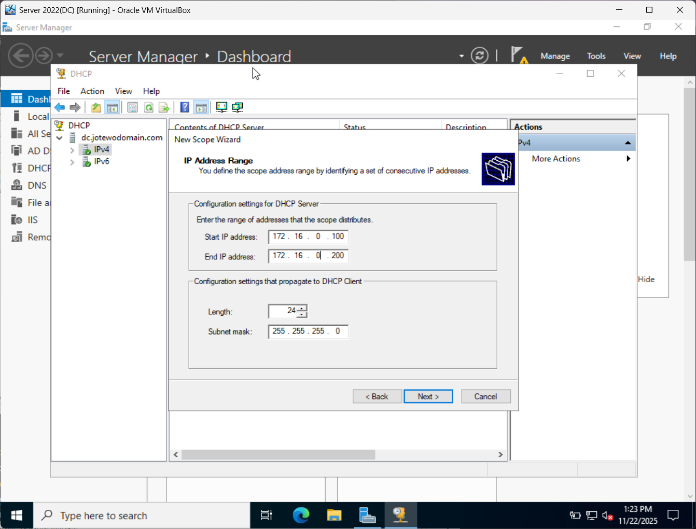

# Remote Access and DHCP Server Setup

## Objective:
In this section, I will show how to configure **Remote Access (NAT Routing)** and **DHCP Server** on the Windows Server 2022 Domain Controller. These services enable client machines in the internal network to:
- Access the internet through the Domain Controller
- Automatically receive IP Addresses, default gateway, DNS settings, and subnet mask
- Communicate properly within the lab environment

Essentially, this configuration allows for Windows 10 client VMs to join the domain and operate like real corporate workstations.

## Overview:
We will complete two major configurations: **NAT Routing** and **DHCP Server**.

1. **Remote Access(NAT Routing)**:
    - This allows for the Domain Controller to act like a **Router** for the internal network. The usage of NAT allows for the DC's outbound interface to touch the internet, while the internal network remains isolated.
2. **DHCP Server**:
    - The **DHCP** role will automatically assign/lease out IP addresses and network settings to all internal client machines. 

## Step 1: Install Remote Access (NAT) and DHCP Server Roles
1. Open up **Server Manager** > Click **Manage** (top-right) > **Add Roles and Features**.
2. A Wizard should pop up, click **Next** until you reach the **Server Roles** Section.
3. Check the boxes for **DHCP Server** and **Remote Access**,
4. Click 'Next' until you reach **Role Services** > Select **Routing** and click **Add Features** when prompted.
5. Continue clicking **Next** until you reach the **Confirmation** Page, then click **Install**.
6. Wait for the installation to finish and then close the window

## Step 2: Enable NAT Routing
1. Open **Routing and Remote Access** from **Tools** in Server Manager.
2. Right-click on the server(DC) > Select **Configure and Enable Routing and Remote Access**.
3. The wizard will pop up to set up the NAT Routing, click **Next** to go to the configuration section.
4. On the configuration window, select **Network Address Translation(NAT)**. This will allow internal machines to have access to the internet under one public IP Address. Click **Next** to advance with the setup.
5. Next, you need to select a public network interface to use for client computers to connect to the internet. Select the network interface that you labelled earlier in the network configuration tutorial as the **Internet** and click "Next" to advance.
6. Click **"Finish"** to complete the **NAT Routing** setup and allow the installation to complete.

Your Domain Controller will now provide internet access to all machines in the Internal Network!

## Step 3: Configure DHCP Scope

The purpose of a **DHCP Scope** is to define a range of IP addresses that client machines under the network can receive and lease out for use.

1. Open **DHCP** from **Tools** menu in Server Manager.
2. Click on the  right arrow next to your domain to expand it > Right-Click on **IPv4** and select **"New Scope"**.
3. You will be asked to enter a name and description of the scope, name it whatever you want like **"InternalNetScope"** > Click "Next" to advance.
4. Next is defining the **DHCP Scope Range** of IP addresses that client machines can be assigned for. A starting and ending IP addresses need to be defined, as well as the **Subnet Mask**. Use the following values for defining the scope range:
    - **Start IP Address**: 172.16.0.100
    - **End IP Address**: 172.16.0.200
    - **Subnet Mask**: 255.255.255.0

These values for the start and end IP addresses with the subnet mask indicate that there will be a range of 100 different IP addresses that the **DHCP Server** has to assign to client machines within the network. The **Subnet Mask** of 255.255.255.0 is to seperate an IP address into a network portion and host portion where the first three octets(172.16.0) identifies the network and the last octet is for identifying individual devices. You can make the comparison to street addresses, where the street name is the network portion and the house number is the host portion.

5. Then, you will be given the option to **Add Exclusions and Delay** to IP Addresses. Skip this by clicking 'Next'
6. For the **Lease Duration** section of the setup, you can define how many days, hours, and minutes a client can use the assigned IP Address. You can set it for a week as an example. 
7. Click "Yes" when on the **Configure DHCP Options** section to configure the options now.
8. For the **Router (Default Gateway)** section, enter 172.16.0.1 as the IP Address and click the "Add" button to set it.
9. On the **Domain Name and DNS Servers** section, click "Next" as it should already on the domain name and the DNS Server added.
10. Continue to click "Next" until you reach a section where it asks if you want to activate the scope now. Select "Yes" > "Next" > then click "Finish".
11. Finally, right-click on the domain name and click **"Authorize"** > right-click again and select **"Refresh"** to update the DHCP Servers.

Now, you should see the scope that you created is **Active** and appears under the IPv4 option!

## Summary

At this point, the **Domain Controller** is fully configured to act as a router and DHCP server for the internal network. Your Windows 11 clients will now:

- Automatically receive IP addressing

- Receive DNS information pointing to the Domain Controller

- Have internet access through NAT

- Be able to join the domain

This completes the networking phase of your Active Directory homelab. The next step is using PowerShell Script to create a bulk of users and adding them to the Active Directory to simulate a real-world enterprise!

➡️ Continue to: [Creating Bulk Active Directory Users with PowerShell](./05_bulkusers_active-directory.md)