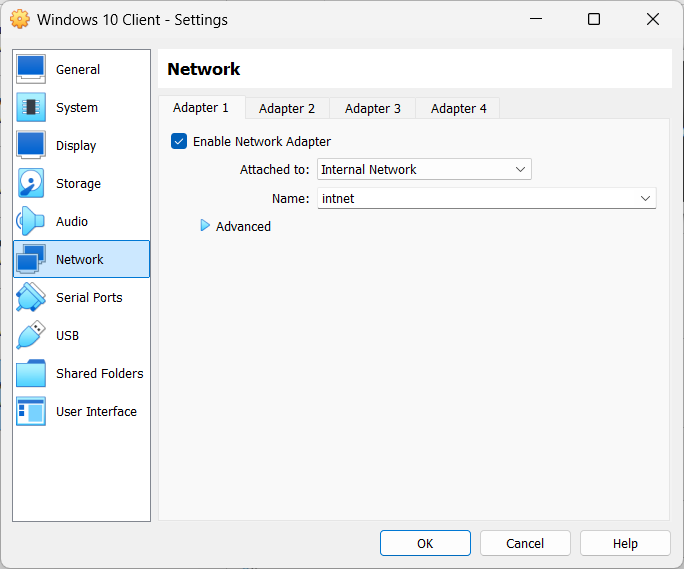
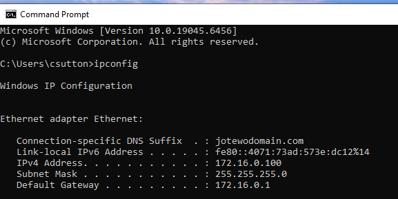
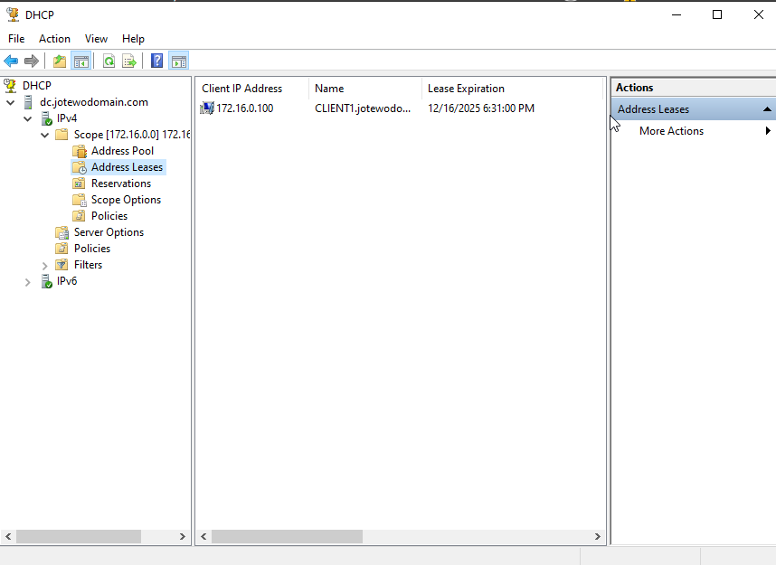

# Windows 10 Client VM Setup and Joining to Domain

## Objective:

In this section, I will demostrate how to create a **Windows 10 or 11 Client Virtual Machine** inside **VirtualBox**, configure it for the internal network, and join it to the **Active Directory Domain** that was previously set up on the Windows Server 2022 Domain Controller.

By doing this, this allows the client machine to authenicate against the domain, receive **Group Policies**, and operate like a workstation inside a real enterprise environment.

## Step 1: Create the Windows 10/11 Virtual Machine
1. Open VirtualBox > Click **'New'**
2. Put the following settings:
    - **Name**: Windows 10/11 Client
    - **ISO Image**: Enter the ISO File for Windows 10 or 11
    - Click **Skip Unattended Installation**
    - **RAM**: 2048MB or 4096MB depending on your host machine
    - **Processors**: 1 or 2
    - **Hard Disk**: Select 'Create a virtual hard disk' > Set to 50GB or more
3. Click 'Finish'


## Step 2: Configure Network Settings for Domain Connectivity
For this step, we need to adjust the network settings on the **Windows Client VM** by disabling **NAT** and restricting internet access within our local network. The purpose of this is to make the Client VM connect to the internet through the **Domain Controller** by obtaining an IP Address through **DHCP**. Here is what to do for configuring the network settings:

1. Select the Windows Client VM that you created > Click **"Settings"** on top of the window with the yellow gear icon > Go down to the **Network** section.
2. Change **Adapter 1**:
    - Check **Enable Network Adapter**
    - **Attached To:** Internal Network
    - **Name:** intnet (Same name used for Windows Server VM)

Make sure that there are no network adapters that use **NAT** as we want the client VM to connect through the Internal Network.



## Step 3: Install Windows 10 on the Client VM
1. Click on the newly created Server 2022 VM and boot it up.
2. Proceed through the installation by selecting options like Language to Install, Time, etc.
3. You will be asked if you have a product key to activate Windows, select **"I don't have a product key"**.
4. For the selection of the Operating System > Select **Windows 10/11 Pro**.
5. Select **Custom Install** for the type of installation.
6. Wait for the installation to fully complete. It should take a few minutes.
7. Once the installation is complete, you will then be in the setup for Windows 10/11/
8. When you reach the section of the setup where it asks to connect to a network, select **"I don't have internet"**.
9. Next, you will be prompted to connect with a Microsoft account, click **"Continue with Limited Setup"**.
10. Finally, you will be asked to create a user for the computer and enter a password. Make sure to create a password that you can easily remember for easier access.

Once the setup process for Windows has finished, login into Windows with the user that you created.

## Step 4: Test out Connectivity with Domain Controller

Let's test out and see if the Windows Client VM is connected with the internal network from the **Domain Controller** and is able to communicate!

1. First, boot up your **Windows Server 2022 VM** so that the client VM can communicate with the **Domain Controller**.
2. Open **Command Prompt** on the Client VM > Type the following command into the terminal:
```bash 
ipconfig
```
3. The terminal will respond with your current network info. Your network info should look similar to this:

As you can see in the screenshot above, the **IP Address** that has been leased out to the client VM is **172.16.0.100**, which falls under the DHCP lease pool of the Domain Controller that we configured earlier. The same can be said for the **Subnet Mask** and **Default Gateway**. This means that the client VM is successfully connected with the internal network.

If you don't see any output for the **Default Gateway** or the **IP Address**, try running ```ipconfig /renew ```. Otherwise, backtrack to the DHCP Setup document and make sure nothing was missed during the configuration.

4. Finally, let's test out if the client VM can connect to the internet and the domain by using:
    - ```ping www.google.com``` - **Connection to Internet**
    - ```ping "enter domain here"``` - **Connection to Domain**
    - If successful, you should get 4 replys to indicate packets of data are being sent and received.


## Step 5: Join the Client to the Domain

1. Open **Settings** > **System** > **About**.
2. Scroll down to the **Related Settings** > Select **Rename this PC (Advanced)**.
3. You will be instructed to sign in with an Admin account, sign in with the admin account you created using the **Domain Controller**.
4. A window will pop up to change the system's properties. On the **Computer Name** tab, click the **"Change"** button that allows the user to change the computer's name or its domain.
5. Once clicked, another window will appear that allows you to change the computer's name and it's domain. Enter the following:
    - **Computer Name**: CLIENT1(for being able to identify easily)
    - **Domain**: Your Domain Name (EX: jotewodomain.com)
6. Once you entered the information, click **Enter** and you should see a message, welcoming the user into the domain.
7. Then, you will be asked to restart the computer to confirm changes.


## Step 8: Log in using a Domain User
After your computer restarts and you're on the login screen:
1. Click **Other User** to sign in with a new account
2. Sign in using a domain user account that was created earlier with the PowerShell Script:
    - **Username Example**: aacre
    - **Password**: Password1

If successful, Windows should be setting up the user and the client machine will be joined and communicating with **Active Directory**.


## Step 6: Verify IP Address Lease from DHCP
Finally, let's ensure that the Windows Client is properly receiving an **IP Address** from the Domain Controller.

**On the Domain Controller:**
1. Open **Server Manager** > **Tools** > **DHCP**
2. The **DHCP** window will pop up. Click on the right arrow next to your domain to expand.
3. Expand **IPv4** > **Scope** > Click **Address Leases**.
4. In the middle of the window, you will see:
    - **Client VM's IP Address**: 172.16.0.100
    - **Client VM's Hostname**: CLIENT1@domainname.com
    - **Lease Expiration Date**: 12/16/2025



This confirms that the DC is correctly acting as the DHCP server for the internal network.

## Conclusion

Your Windows Client VM is now successfully networked, receiving IP configuration from DHCP, and joined to your Active Directory domain. This completes the client-side setup and prepares your environment for further enterprise-level configurations such as User Account Management, Group Policy, file sharing, security baselines, and workstation management.

➡️ Continue to: **[User Account Management (Help Desk Operations)](./06_user_account_management.md)**


