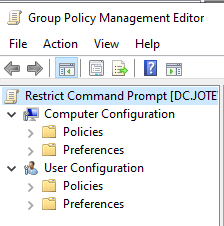

# Group Policy Management(GPO Setup)

## Objective:

This section demonstrates how **Group Policy Objects (GPOs)** are created, linked, and enforced within an Active Directory environment to centrally manage user and computer configurations. Group Policy is a core tool used by system adminstrators and IT Support teams used to enforce security standards, limit user actions, and automate workstation at large scale.

---

## Prequisities: 
Before completing this section of the homelab, it is important to have followed the previous setup documents and have configured the following:
- Windows Server 2022 Domain Controller
- Active Directory Domain Services(AD DS)
- Organizational Units (OU) created
- Domain Users created and managed
- Windows client machine joined to the domain
- Basic user account management completed

## Overview:

The purpose of **Group Policies** are to allow adminstrators to define and enforce rules for users and computers in a domain. Policies are applied automatically based on **Organizational Unit(OU)** placement and ensure consistency, security, and complicance across the environment.

In this lab, I will demonstrate how to configure the following group policies:

- Restrict Command Prompt access for standard users
- Enforce Password and Account Lockout Policies
- Disable USB Devices
- Map network drives automatically
- Enforce an universal desktop wallpaper

---

## Step 1: Open Group Policy Management Console(GPMC)
1. Boot up and login into your **Domain Controller**.
2. Open **Server Manager** > **Tools** > **Group Policy Management** or use the search bar on the **Task Bar**.
3. A window should appear on the screen. On the left-hand side, you will see a **'Forest'** object with your domain name.
4. Expand **Forest** > **Domains** > **Your Domain Name**.
5. You will see under your domain that the **Organizational Units** you created earlier will appear.

Next, I will be showing how to create GPOs for different policies to be applied to all standard users in the domain. All of the policies can either be applied to a single **GPO Object** for convienence or created separately for easier reusability across other OUs. For these examples, I will create a seperate GPO for each of them.

## Step 2: Create a GPO for Standard Users

1. Right-click on the **_USERS** Organizational Unit.
2. Select **"Create a GPO in this domain, and Link in here..."**
3. Name the **GPO** the policy you want to enforce.

---

## GPO 1: Disable Command Prompt for Users

#### Purpose:
This policy prevents standard users from accessing the Command Prompt, reducing the risk of unauthorized system changes and command-line misuse.

### Step 3: Edit the GPO
1. Create the **GPO** by following the step above and name it: **Disable Command Prompt**.
2. Right-click on the GPO and select **Edit** to open the **Group Policy Management Editor**.

---

#### Understanding GPO Configuration Types

The **Group Policy Management Editor** window will appear on your screen. On the left side, the "Disable Command Prompt" GPO will have two main configuration types: **Computer Configuation** and **User Configuration**. Each of these contains two subcategories called **Policies** and **Preferences**, which define how settings are applied.

- **Computer Configuration:** These settings are applied to the computer itself, regardless of which user logs in. They are processed when the system starts.
    - **Example:** Disabling USB storage devices on all company computers so no user can plug in a flash drive.

- **User Configuration:** These settings are applied to user accounts when they log in, no matter which computer they use.
    - **Example:** Preventing standard users from opening the **Command Prompt**, even if they sign in on different workstations.

- **Policies:** Policies are **strictly enforced settings** that users cannot override. If the GPO is removed, the system usually reverts back to its default state.
    - **Example:** Enforcing a password complexity policy that requires users to use uppercase letters, numbers, and symbols.

- **Preferences:** Preferences are **not-enforced settings** that set defaults but allow users to change them later.
    - **Example:** Automatically mapping a network drive (e.g., **Z: drive**) for users when they log in, while still allowing them to disconnect it if needed.

---

### Step 4: Disable Command Prompt via User Policy

1. Navigate to **User Configuration** > **Policies** > **Adminstrative Templates** > **System**

