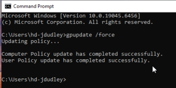
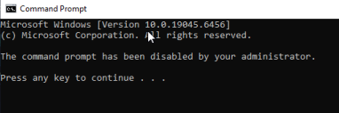
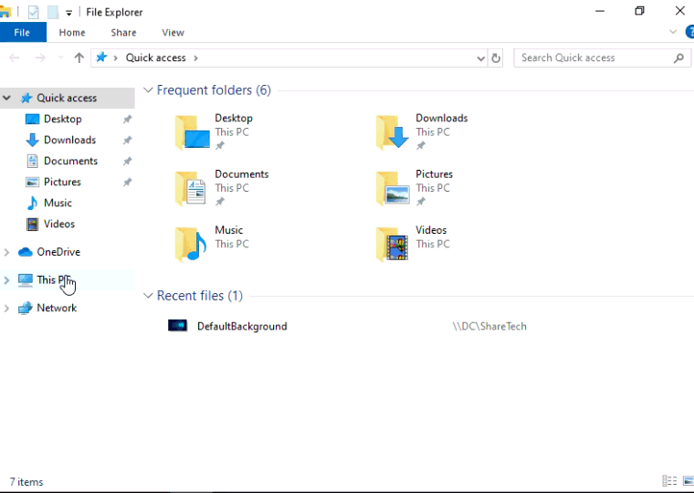

# Group Policy Management(GPO Setup)

## Objective:

This section demonstrates how **Group Policy Objects (GPOs)** are created, linked, and enforced within an Active Directory environment to centrally manage user and computer configurations. Group Policy is a core tool used by system adminstrators and IT Support teams used to enforce security standards, limit user actions, and automate workstation at large scale.

---

## Prequisities: 
Before completing this section of the homelab, it is important to have followed the previous setup documents and have configured the following:
- Windows Server 2022 Domain Controller
- Active Directory Domain Services(AD DS)
- Organizational Units (OU) created
- Domain Users created and managed
- Windows client machine joined to the domain
- Basic user account management completed

## Overview:

The purpose of **Group Policies** are to allow adminstrators to define and enforce rules for users and computers in a domain. Policies are applied automatically based on **Organizational Unit(OU)** placement and ensure consistency, security, and complicance across the environment.

In this lab, I will demonstrate how to configure the following group policies:

- Restrict Command Prompt access for standard users
- Enforce Password and Account Lockout Policies
- Disable USB Devices
- Map network drives automatically
- Enforce an universal desktop wallpaper

---

## Steps: Open Group Policy Management Console(GPMC)
1. Boot up and login into your **Domain Controller**.
2. Open **Server Manager** > **Tools** > **Group Policy Management** or use the search bar on the **Task Bar**.
3. A window should appear on the screen. On the left-hand side, you will see a **'Forest'** object with your domain name.
4. Expand **Forest** > **Domains** > **Your Domain Name**.
5. You will see under your domain that the **Organizational Units** you created earlier will appear.


Next, I will be showing how to create GPOs for different policies to be applied to all standard users in the domain. All of the policies can either be applied to a single **GPO Object** for convienence or created separately for easier reusability across other OUs. For these examples, I will create a seperate GPO for each of them.

## Steps: Create a GPO for Standard Users

1. Right-click on the **_USERS** Organizational Unit.
2. Select **"Create a GPO in this domain, and Link in here..."**
3. Name the **GPO** the policy you want to enforce.


---

## GPO 1: Disable Command Prompt for Users

##### Purpose:
This policy prevents standard users from accessing the Command Prompt, reducing the risk of unauthorized system changes and command-line misuse.

### Steps: Edit the GPO
1. Create the **GPO** by following the step above and name it: **Disable Command Prompt**.
2. Right-click on the GPO and select **Edit** to open the **Group Policy Management Editor**.

---

#### Understanding GPO Configuration Types

The **Group Policy Management Editor** window will appear on your screen. On the left side, the "Disable Command Prompt" GPO will have two main configuration types: **Computer Configuation** and **User Configuration**. Each of these contains two subcategories called **Policies** and **Preferences**, which define how settings are applied.


- **Computer Configuration:** These settings are applied to the computer itself, regardless of which user logs in. They are processed when the system starts.
    - **Example:** Disabling USB storage devices on all company computers so no user can plug in a flash drive.

- **User Configuration:** These settings are applied to user accounts when they log in, no matter which computer they use.
    - **Example:** Preventing standard users from opening the **Command Prompt**, even if they sign in on different workstations.

- **Policies:** Policies are **strictly enforced settings** that users cannot override. If the GPO is removed, the system usually reverts back to its default state.
    - **Example:** Enforcing a password complexity policy that requires users to use uppercase letters, numbers, and symbols.

- **Preferences:** Preferences are **not-enforced settings** that set defaults but allow users to change them later.
    - **Example:** Automatically mapping a network drive (e.g., **Z: drive**) for users when they log in, while still allowing them to disconnect it if needed.

---

### Steps: Disable Command Prompt via User Policy

1. Navigate to **User Configuration** > **Policies** > **Adminstrative Templates** > **System**.
2. Once in the system folder, search and locate the following policy: **"Prevent access to the command prompt"** > Double-click on it to open.
3. The window will pop up where it will give an explanation on what the policy does and if you want to enable it.
4. Select the **Enabled** option and click **Apply** > **OK** to enforce the policy on the GPO.
5. Set **Disable command prompt script** processing to **Yes**.
6. Close the editor.


---

## GPO 2: Password & Account Lockout Policy

##### Purpose: 
This policy enforces strong password complexity, expiration, and account lockout rules to protect domain accounts from brute-force attacks and unauthorized access. Centralizing password enforcement ensures consistent security standards across all users in the domain.

### Steps: Enforce Password Complexity Policy

1. Create a new **GPO** called **"Password Policy"** or edit the **"Default Domain Policy"** GPO under your domain in order to enforce the policy throughout the domain.
2. Right-click on your GPO and select **Edit**.
3. Navigate to: **Computer Configuration** > **Policies** > **Windows Settings** > **Account Policies**.
4. Click on **Password Policy** to make changes to the password requirements.
5. There are multiple rules that you can set for the password policy like:
    - **Minimum Password Length**
    - **Maximum Password Age**
    - **Enforce Password History**
6. For this lab, we will only configure the **"Password must meet the complexity requirements"**.
7. Double-click on the policy > Select **Enabled** > Click **Apply**.


### Steps: Enforce Account Lockout Policy

1. Create a new **GPO** called **"Account Lockout Policy"** or edit the **"Default Domain Policy"** GPO under your domain in order to enforce the policy throughout the domain.
2. Right-click on your GPO and select **Edit**.
3. Navigate to: **Computer Configuration** > **Policies** > **Windows Settings** > **Account Policies**.
4. Click on **Account Lockout Policy** to make changes to the account lockout settings.
5. Configure the following policies:
    - **Account Lockout Duration:** 30 minutes
    - **Account Lockout Threshold:** 5 invalid logon attempts
    - **Reset Account Lockout Counter After:** 30 minutes
6. Close the editor to save changes.


---

## GPO 3: Disable USB Storage Devices

##### Purpose:
This policy blocks the use of USB storage devices on domain computers to prevent data exfiltration, malware introduction, and unauthorized file transfers. Disabling removable media is a common enterprise security control used to protect sensitive information.

#### Steps: 
1. Create a new **GPO** called **Disable USB Devices** inside the **_COMPUTERS** OU or edit the **Default Domain Policy** GPO if you want this enforced throughout the entire domain.
2. Right-Click on this GPO and select **Edit**.
3. Navigate to: **Computer Configuration** > **Policies** > **Adminstrative Templates** > **System** > **Removable Storage Access**.
4. Enable the following policy:
    - **All Removable Storage Classes: Deny all access**
5. Close the editor.


---

## GPO 4: Map Network Drives Automatically

##### Purpose:
This policy automatically maps network drives for users at logon, providing consistent and easy access to shared resources such as departmental files and documentation. Automating drive mapping reduces manual configuration and improves user productivity.

#### Steps:

1. Create a **GPO** named **"Map Network Drives"** inside of the **_USERS** OU > Right-Click on the GPO and select **Edit**.
2. Navigate to: **User Configuration** > **Preferences** > **Windows Settings** > **Drive Maps**.
3. Right-Click on the **Drive Maps** menu and click **New** > **Mapped Drive**.


4. To create a shared network drive, configure the following properties:
    - **Action:**: Create
    - **Location:** \\DC\SharedFolder or \\(Name of DC)\(Name)
    - **Drive Letter:** Pick one (e.g.; **C:**)
    - **Label as:**: Shared Drive
5. Click **OK** to confirm.

As a result, all users in the **_USERS** OU will automatically receive a mapped network drive at logon.


---

## GPO 5: Enforce a Universal Desktop Wallpaper

##### Purpose:
This policy enforces a standardized desktop wallpaper across all domain users to maintain a consistent corporate appearance. It can also be used to display branding, security notices, or compliance messages in enterprise environments.

#### Steps:
1. Create a **GPO** named **"Universal Desktop Wallpaper"** inside of the **_USERS** OU > Right-click on the GPO and select **Edit**.
2. Navigate to: **User Configuration** > **Policies** > **Adminstrative Templates** > **Desktop** > **Desktop**.
3. Enable **Desktop Wallpaper Policy**.
4. Set the following settings to your desire:
    - **Wallpaper Name:** UNC Path to image (e.g \\\DC\Wallpapers\HomeBackground.jpg)
    - **Wallpaper Style:** Fill or Stretch
5. Click **Apply > Ok**.

As a result, all of the users will receive a consistent desktop wallpaper across the domain.

## Verification and Testing of Applied GPOs:

After configuring all **Group Policy Objects**, it is important to verify that each policy is correctly applied and functioning as intended on a domain-joined client machine.

**Note:** Ensure that the **Restrict Command Prompt GPO** is temporarily disabled or unlinked from the **_USERS Organizational Unit** before forcing a **Group Policy** update. Access to Command Prompt or PowerShell is required to run 
```gpupdate /force``` and ```gpresult /r```

After completing all verification steps, this GPO can be re-enabled to enforce standard user restrictions.

##### Step 1: Force Group Policy Update
1. Log in to the Windows client machine using a standard domain user account.
2. Open **Command Prompt or Powershell**.
3. Run the following command in the terminal.
```gpupdate /force```
    - You should see this output as a result to confirm the changes have been made:
    
4. Log out and log back in when prompted.

##### Step 2: Verify Applied Group Policies

To confirm which policies are applied to the user and computer:

1. Open **Command Prompt** on the client machine.
2. Run the following command in the terminal:
```gpresult /r```
3. Verify that the configured GPOs appear under **Applied Group Policy Objects** for both the user and the computer.


##### Step 3: Test Each GPO

- GPO: **Disable Command Prompt**
    - Attempt to open **Command Prompt** as a standard user
    - **Expected Result:** Message saying that "The command prompt has been disabled by your adminstrator."


- GPO: **Enforce Password and Account Lockout Policies**

    - Attempt to change a password to one that does not meet complexity requirements.
    - **Expected Result:** Password change is rejected.
    - Enter an incorrect password multiple times.
    - **Expected Result:** Account becomes locked after reaching the configured threshold.


- GPO: **Disable USB Storage Devices**
    - Insert a USB flash drive into the client machine
    - **Expected Result:** Device is blocked and inaccessible

-  GPO: **Map Network Drives Automatically**
    - Log out and log back in
    - Open **File Explorer** > **This PC**.
    - **Expected Result:** You should see the newly mapped network drive appearing on the bottom of the window, under **Network Locations**.
    

- GPO : **Enforce Universal Desktop Wallpaper**
    - Login as a domain user
    **Expected Result:** The desktop wallpaper should match the enforced image that you selected when creating the GPO.
    

##### Step 4: Troubleshooting (If Needed)

If a policy does not apply as expected:
- Confirm the user that you are logged in as is in the correct **Organizational Unit(OU)**,
- Ensure the GPO is **Linked** and **Enabled**.
- Check **Security Filtering** and **WMI Filters**.
- Re-run: ```gpupdate /force```

## Conclusion:

Successfully verifying each **Group Policy** confirms that centralized management is functioning correctly within the **Active Directory environment**. This validation step mirrors real-world IT administration workflows and ensures policies are enforced consistently across all users and computers in the domain.